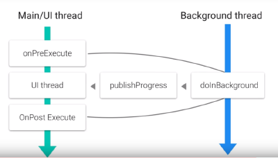

## Connect to Internet

  1. Introduction

  2. Logging
     - Logging Display Levels :
       - ERROR (preserved in release versions)
       - WARN  (preserved in release versions)
       - INFO (preserved in release versions)
       - DEBUG
       - VERBOSE
       - WTF
     - WTF Level (What a terrible failure : a special level)

  3. Internet Toy App Intro

  4. Exercise: Create a Layout

  5. Resources

  6. On Menus

     - There are 3 fundamental types of Menus :

       - Options Menu (App bar)
         - It is the primary collection of menu items for an activity. 
         - It's where you should place actions that have a global impact on the app, such as "Search," "Compose email," and "Settings."
       - Context Menu and Contextual action mode
         - A context menu is a floating menu that appears when the user performs a long-click on an element. 
         - It provides actions that affect the selected content or context frame.
         - *Contextual action mode* displays action items that affect the selected content in a bar at the top of the screen and allows the user to select multiple items.
       - Popup Menu
         - A popup menu displays a list of items in a vertical list that's anchored to the view that invoked the menu. 
         - It's good for providing an overflow of actions that relate to specific content or to provide options for a second part of a command.
         - Actions in a popup menu should not directly affect the corresponding content—that's what contextual actions are for.

     - Defining a Menu in XML

       - For all menu types, Android provides a standard XML format to define menu items.

       - Instead of building a menu in your activity's code, you should define a menu and all its items in an XML menu resource. 

       - You can then inflate the menu resource (load it as a Menu object) in your activity or fragment.

       - To define the menu :

         ````
         //create an XML file inside your project's res/menu/ directory
         //<menu> 
         	//Defines a Menu, which is a container for menu items. 
         	//A <menu> element must be the root node for the file and can hold one or more <item> & <group> elements.
         //<item>
         	//Creates a MenuItem, which represents a single item in a menu. 
         	//This element may contain a nested <menu> element in order to create a submenu.
         //<group>
         	//An optional, invisible container for <item> elements. 
         	//It allows you to categorize menu items so they share properties such as active state and visibility.
         ````

       - You inflate the menu in onCreateOptionsMenu() method in your Activity or Fragment

       - If u want to change the menu items during runtime override onPrepareOptionsMenu()

       - To handle item clicks override onOptionsItemSelected() method and call getItemId() to get the id of the item clicked

       - When you successfully handle a menu item, **return true**. If you don't handle the menu item, you should pass the menu item to the superclass implementation. If your activity includes fragments, the activity receives this callback first. By calling the superclass when unhandled, the system passes the event to the respective callback method in each fragment, one at a time (in the order each fragment was added) until true or false is returned. *(The default implementation for Activity and android.app.Fragment return false, so you should always call the superclass when unhandled.)*

  7. Exercise: Add a Menu

  8. Exercise: Build our URL

     - Use Uri.Builder class to create the URI
     - convert the URI to Java URL

  9. Fetching an HTTP Request

     - For doing it purely in Java :
       - using the Java URL create an HttpURLConnection object by calling url.openConnection()
       - then get an InputStream by calling httpUrlConnection.getInputStream()
       - Now use a Scanner class to read this stream
         - first set a delimiter by calling scanner.setDelimiter("\\\A")
         - next check if scanner.hasNext() and if true then call snanner.next() which will return a String
         - finally close the url connection by calling httpUrlConnection.disconnect()


     - Some of the libraries that can be used here are :
       - OkHttp (by Square)
       - Retrofit (by Square)
       - Volley (supported by Google)

  10. Permissions

  11. Quiz: Permissions

  12. Exercise: Connect to the Internet

      - if u directly try to make a network call on the main UI thread the Android system will throw a *NetworkOnMainThreadException* exception

  13. Thread Basics

      - there is a single user interface thread in Android
      - in order to maintain 60 fps all operations should get completed in nearly 17 ms
      - hence everything else should be done in a secondary thread and the results should be brought back to the main UI thread

  14. AsyncTask

      - Allows you to run a task on a background thread while publishing results on the main UI thread

      - The main UI thread has a message queue and a handler to get serialized objects from other threads

      - AsyncTask wraps this behavior inside a simple interface

        - AsyncTask is a generic class. Meaning it takes parameterized types in its constructor.

        - An asynchronous task is defined by 3 generic types, called 

          - Params : parameters sent to the task upon execution -> doInBackground
          - Progress: type published to update progress during execution -> onProgressUpdate
          - Result : the type of the result after completion -> onPostExecute 

        - and 4 steps called 

          - onPreExecute, 
          - doInBackground, 
          - onProgressUpdate and 
          - onPostExecute

          

  15. Quiz: AsyncTask

  16. Exercise: Create an AsyncTask

      When an asynchronous task is executed, the task goes through 4 steps:

      1. onPreExecute(), invoked on the UI thread before the task is executed. This step is normally used to setup the task, for instance by showing a progress bar in the user interface.
      2. doInBackground(Params...), invoked on the background thread immediately after onPreExecute() finishes executing. This step is used to perform background computation that can take a long time. The parameters of the asynchronous task are passed to this step. The result of the computation must be returned by this step and will be passed back to the last step. This step can also use publishProgress(Progress...) to publish one or more units of progress. These values are published on the UI thread, in the onProgressUpdate(Progress...) step.
      3. onProgressUpdate(Progress...), invoked on the UI thread after a call to publishProgress(Progress...). The timing of the execution is undefined. This method is used to display any form of progress in the user interface while the background computation is still executing. For instance, it can be used to animate a progress bar or show logs in a text field.
      4. onPostExecute(Result), invoked on the UI thread after the background computation finishes. The result of the background computation is passed to this step as a parameter.

  17. Exercise: Missing Permissions

  18. Exercise: Add Polish

  19. JSON Format

  20. Quiz: JSON by Hand

  21. Quiz: Parse JSON

  22. Exercise: Networking

  23. Exercise: Menus

  24. Exercise: Add Loading Polish

  25. Refresh Bad!!!

  26. Recap