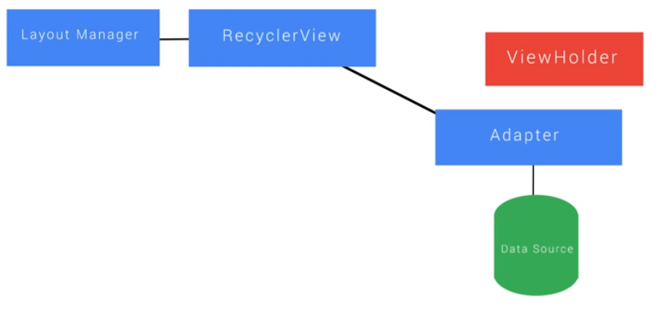

## RecyclerView

 1. Introduction

 2. Why RecyclerView?

    Difference between ListView and RecyclerView :

    - bla
    - bla

 3. How RecyclerView Works

    - It recycles the views which are not visible and bind the data again in the same view elements.

 4. Using RecyclerView

    - While using a RecylerView we have following modular parts :
      - RecyclerView
      - Adapter
      - Data Source
      - ViewHolder
      - LayoutManager
      - 

 5. Why ViewHolders?

 6. Quiz: findViewByld() Calls

 7. Visualizing ViewHolders

 8. Creating RecyclerView Layout

 9. Exercise: Create RecyclerView

 10. Items and ViewHolders

 11. Exercise: Items and ViewHolders

 12. RecyclerView and Adapters

 13. Quiz: Adapters and RecyclerView

 14. Creating an Adapter

 15. Exercise: Create an Adapter

 16. RecyclerView Layout Manager

 17. Wiring Up RecyclerView

 18. Exercise: Wiring Up RecyclerView

 19. Visualizing Recycling

 20. Responding to Item Clicks

 21. Exercise: Click Handling

 22. Exercise: Create a RecyclerView

 23. Exercise: Click Handling

 24. Recap

