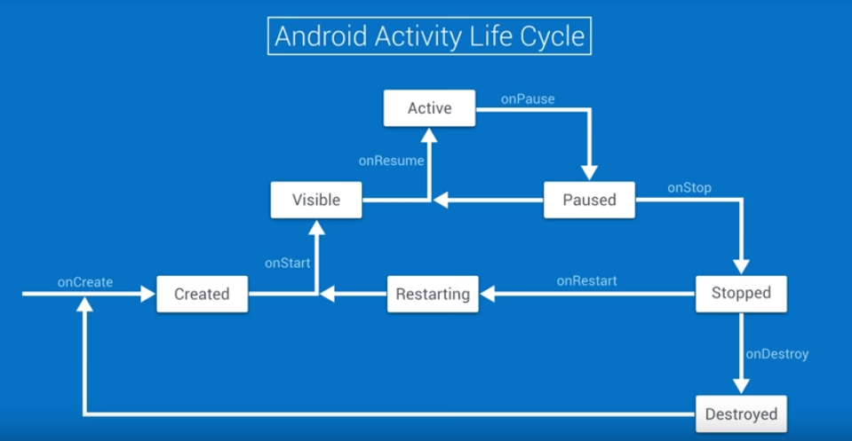

## Lifecycle

 1. Introduction

 2. Why We Need an Activity Lifecycle

 3. Android Activity Lifecycle

    

 4. Reto on the Android Activity Lifecycle

 5. Exercise: Lifecycle Events

    - What is the order that the lifecycle events are called after the device is rotated ?
      - onPause, onStop, onDestroy, onCreate, onStart, onResume

 6. Why does this Happen?

 7. Save and Restore Instance State

 8. Exercise: Persisting Data

 9. Exercise: Fix the Lifecycle Display

 10. App Termination

 11. Preparing for Termination

 12. Persisting Data With an Old Friend

 13. Exercise: Persisting Data Part Two

 14. AsyncTask and Loaders

 15. Quiz: Quiz: AsyncTaskLoader Advantages

 16. Leveraging Loaders

 17. Exercise: Add an AsyncTaskLoader

 18. Caching with Loaders

 19. Exercise: Caching with Loaders

 20. Exercise: AsyncTaskLoader in Sunshine

 21. Conclusion