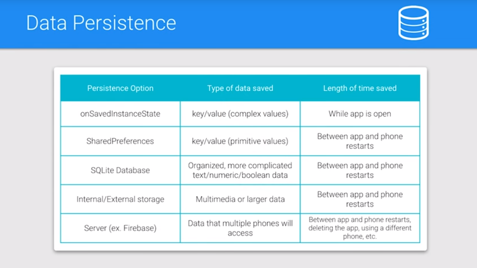

## Preferences

 1. Introduction

 2. Introducing the Visualizer

 3. Visualizer Code

 4. Download the Code

 5. Data Persistence

    

 6. Quiz: Persistant Storage Options

 7. Preference Fragments

 8. Seting up the Settings Activity

 9. Exercise: Setup Settings

 10. Making a PreferenceFragment

 11. Exercise: Make a Preference Fragment

 12. Reading From SharedPreferences

 13. Exercise: Reading from SharedPreferences

 14. Use Resources!

 15. Exercise: Use Resources

 16. Why Aren’t The Preferences Changing?

 17. Preference Change Listener

 18. Exercise: Preference Change Listener

 19. Add Two More Checkboxes

 20. Exercise: Add Two More Checkboxes

 21. List Preference

 22. Exercise: List Preference

 23. Preference Summary

 24. Exercise: Preference Summary

 25. Edit Text Preference

 26. Exercise: Edit Text Preference

 27. Edit Size Crashes

 28. Edit Text Preference Constraints

 29. Exercise: Edit Text Preference Constraints

 30. Preferences in Sunshine

 31. Should it be a Setting

 32. Exercise: Create the SettingsActivity in Sunshine

 33. Solution: Create the SettingsActivity in Sunshine

 34. Exercise: Create the PreferenceFragment in Sunshine

 35. Exercise: Update the MainActivity

 36. Conclusion