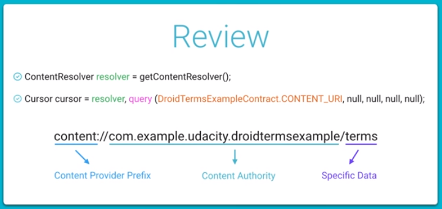

## Content Providers

1. Introduction

2. Content Providers

   - Content providers can help an application **manage access to data** stored by itself, stored by other apps, and provide a way to share data with other apps. 
   - They encapsulate the data, and provide mechanisms for defining data security.
     - 
     - You implement a content provider for :
       - Sharing access to your application data with other applications
       - Sending data to a widget
       - Returning custom search suggestions for your application through the search framework using *SearchRecentSuggestionsProvider*
       - Synchronizing application data with your server using an implementation of *AbstractThreadedSyncAdapter*
       - Loading data in your UI using a *CursorLoader*

3. Content Provider Advantages

   - easily change underlying data source
   - leverage functionality of Android classes like CursorLoader
   - allow many apps to access, modify and use a data source securely 

4. DroidTermsExample

5. Exercise: Setup QuizExample

   - General Steps for Using a ContentProvider. You will take the following steps:
     - [ ] Get permission to use the ContentProvider.
     - [ ] Get the ContentResolver
     - [ ] Pick one of four basic actions on the data: query, insert, update, delete
     - [ ] Identify the data you are reading or manipulating to create a URI
     - [ ] In the case of reading from the ContentProvider, display the information in the UI

6. Content Provider Permissions

7. Exercise: Add the Permission

8. The Content Resolver

   - there are multiple ContentProviders on the phone

   - also your app is not the only app running on the device, there are other apps running in parallel who might be trying to fetch data from the same ContentProvider

   - *The Content Resolver acts as an intermediary between each app and the content provider or providers it wants to access. It handles inter-process communication and keeps everything in sync and running smoothly.*

   - so in order to access a ContentProvider the next step is to get a ContentResolver by calling 

     ````
     ContentResolver contentResolver = getContentResolver();
     ````

9. Four Basic Operations

   - Read from the data ---> query()
   - Add a row or rows to the data ---> insert()
   - Update the data ---> update()
   - Delete a row or rows from the data ---> delete()

10. Uniform Resource Identifier

    - URIs are used to identify the location of some data.

    - URLs are a subset of URIs which are meant for identifying network locations such as websites and files on the web.

    - Ex : content://com.example.udacity.droidtermsexample/terms

      - content:// 
        - this is the scheme part
        - this specify a content provider's URI
      - com.example.udacity.droidtermsexample
        - this is the content authority part
        - this specify the name of the ContentProvider to access
      - terms
        - this the path
        - in this example this specify the data that we want to access in this contentprovider (table name)

    - We get this URI from the ContentProvider's contract class which the developers should provide.

    - Final summary :

      

11. Quiz: TVTime

12. Solution: TVTime

13. Quiz: Actor Query

14. Solution: Actor Query

15. Quiz: Calendar Provider

16. Solution: Calendar Provider

17. Calling the ContentProvider

    - Database operations might take some time to execute, so you dont call them on the main thread.
    - In this exercise (to keep things simple) we are calling the query method inside an AsyncTask.

18. Exercise: Make an AsyncTask

19. Structure of the Data

    - the query method return a cursor object
    - a cursor is an iterator which provide read/write access to the data of a content provider
    - in general a cursor is a pointer which points to the rows (one or more) returned by an SQL statement
    - there are 4 parameters which we can pass in the query method (apart from the URI)
      - projection --> filters columns
      - selection --> statement for how to filter rows
      - selection args --> what to filter
      - sort order --> sort order of the data returned

20. Working with Cursors Review

    - a cursor has a position, which is the row it's currently pointing to.
    - at the start the cursor is pointing to row -1, which is nothing.
    - when you call moveToNext() it moves the cursor to the next row **if it can**. And then it will return **true** or **false** depending on if the move was successful.
    - to move to the first row call moveToFirst()
    - each column has an index, and you can get that by calling getColumnIndex(String heading)
    - get<Type>(int columnIndex) where <Type> can be String, int, long etc will return the data
    - getCount() returns the number of rows in the cursor
    - close() will close the cursor and prevent memory leak
      - 

21. Exercise: Use the Cursor

22. Solution: Use the Cursor

23. Conclusion